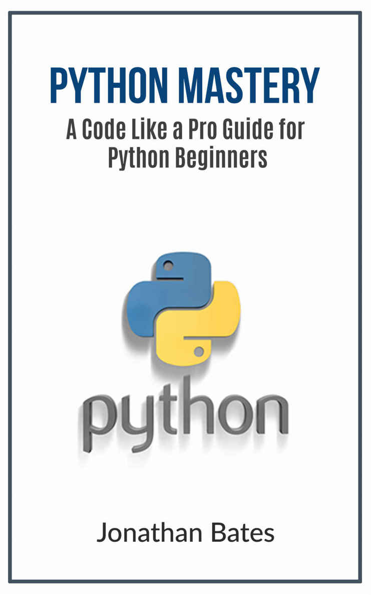
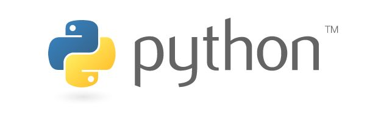

[]{#titlepage.xhtml}

<div>

```{=html}
<svg xmlns="http://www.w3.org/2000/svg" xmlns:xlink="http://www.w3.org/1999/xlink" version="1.1" width="100%" height="100%" viewbox="0 0 741 1186" preserveaspectratio="none">
```
`<image width="741" height="1186" xlink:href="00005.jpeg">`{=html}`</image>`{=html}
```{=html}
</svg>
```

</div>

[]{#part0000_split_000.html}

::: calibre1
[ ]{.calibre3}

[Python Mastery]{.calibre3}

[ ]{.calibre3}

[A']{.calibre6}[Code likea Pr]{.calibre7}[o]{.calibre6}[' Guide for
Python Beginners ]{.calibre7}

[ ]{.calibre9}

[By Jonathan Bates ]{.calibre7}

[ ]{.calibre9}

[ ]{.calibre9}

::: {#part0000_split_000.html#calibre_pb_0 .calibre11}
:::

```{=html}
</p>
```
:::

[]{#part0000_split_001.html}

::: calibre1
\

[FREE GIFT!]{.calibre14}

{.calibre16}

[[DOWNLOAD FREE BOOK
NOW]{.calibre17}](https://myamazingbooks.leadpages.co/tech-talk-books-)

[ABSOLUTELY FREE! Simply click on the link above and enter your email
address and I'll send you a FREE BOOK. You'll also get access to future
promotions, free books and more!]{.calibre19}

[From this free book you\'ll get tons of ideas for computer software,
mobile/social networking apps, web site scripts and blog plug ins. You
can use these ideas to create new ones to sell or to buy or use in your
current business. These types of software can increase your profits,
expand product line, increase your free time, lower your expenses,
accelerate your traffic and lead to more business success. ]{.calibre19}

[[DOWNLOAD FREE BOOK
NOW]{.calibre17}](https://myamazingbooks.leadpages.co/tech-talk-books-)

::: {#part0000_split_001.html#calibre_pb_2 .calibre11}
:::

```{=html}
</p>
```
:::

[]{#part0000_split_002.html}

::: calibre1
\

[Table Of Contents]{.calibre20}

[ ]{.calibre9}

[[Introduction]{.calibre20}](#part0000_split_003.html#_Introduction)

[ ]{.calibre21}

[[Chapter 1: What is
Python?]{.calibre20}](#part0000_split_005.html#_Chapter_1__What)

[ ]{.calibre21}

[[Chapter 2: Why Learn
Python]{.calibre20}](#part0000_split_006.html#_Chapter_2__Why)

[ ]{.calibre21}

[[Chapter 3: Getting Started with
Installation]{.calibre20}](#part0000_split_007.html#_Chapter_3__Getting)

[ ]{.calibre21}

[[Chapter 4: Starting
Techniques]{.calibre20}](#part0000_split_008.html#_Chapter_4__Starting)

[ ]{.calibre21}

[[Chapter 5: Important Techniques and
Strategies]{.calibre20}](#part0000_split_009.html#_Chapter_5__Important)

[ ]{.calibre21}

[[Chapter 6:
Glossary]{.calibre20}](#part0000_split_010.html#_Chapter_6__Glossary)

[ ]{.calibre21}

[[Conclusion]{.calibre20}](#part0000_split_011.html#_Conclusion)

[ ]{.calibre22}
:::

[]{#part0000_split_003.html}

::: {#part0000_split_003.html#_Introduction style="height:0pt"}
:::

::: calibre1
#  [Introduction]{#part0000_split_003.html#2H-36a661741a44426e896092995413f681 .calibre27} {#part0000_split_003.html#calibre_pb_4 .calibre23}

[I want to thank you and congratulate you for downloading the
book]{.calibre9}[,"]{.calibre29}[Python Mastery: A code like a pro guide
for python beginner]{.calibre9}[s"]{.calibre29}[! ]{.calibre9}

[This book contains helpful steps and strategies on how to successfully
use and manage this free programming language tool. This is made to be
an interactive tutorial and guide in mind, so you can code on Python
what you read here.]{.calibre9}

[Programming is not a walk in the park. It requires a lot of patience,
diligence, and understanding, with a bit of logical thinking from time
to time. The high end programming for geniuses, but this ebook will help
you get on the right track.]{.calibre9}

[Thanks again for downloading this book, I hope you enjoy
it!]{.calibre9}

::: {#part0000_split_003.html#calibre_pb_7 .calibre11}
:::

```{=html}
</p>
```
:::

[]{#part0000_split_004.html}

::: calibre1
\

[Copyrigh]{.calibre30}[t]{.calibre31}[ 2016 Jonathan Bates - All rights
reserved.]{.calibre30}

[ ]{.calibre30}

[This document is geared towards providing exact and reliable
information in regards to the topic and issue covered. The publication
is sold with the idea that the publisher is not required to render
accounting, officially permitted, or otherwise, qualified services. If
advice is necessary, legal or professional, a practiced individual in
the profession should be ordered. ]{.calibre9}

[ ]{.calibre9}

[From a Declaration of Principles which was accepted and approved
equally by a Committee of the American Bar Association and a Committee
of Publishers and Associations. ]{.calibre9}

[ ]{.calibre9}

[In no way is it legal to reproduce, duplicate, or transmit any part of
this document in either electronic means or in printed format. Recording
of this publication is strictly prohibited and any storage of this
document is not allowed unless with written permission from the
publisher. All rights reserved. ]{.calibre9}

[ ]{.calibre9}

[The information provided herein is stated to be truthful and
consistent, in that any liability, in terms of inattention or otherwise,
by any usage or abuse of any policies, processes, or directions
contained within is the solitary and utter responsibility of the
recipient reader. Under no circumstances will any legal responsibility
or blame be held against the publisher for any reparation, damages, or
monetary loss due to the information herein, either directly or
indirectly. ]{.calibre9}

[ ]{.calibre9}

[Respective authors own all copyrights not held by the publisher.
]{.calibre9}

[ ]{.calibre9}

[The information herein is offered for informational purposes solely,
and is universal as so. The presentation of the information is without
contract or any type of guarantee assurance. ]{.calibre9}

[ ]{.calibre9}

[The trademarks that are used are without any consent, and the
publication of the trademark is without permission or backing by the
trademark owner. All trademarks and brands within this book are for
clarifying purposes only and are the owned by the owners themselves, not
affiliated with this document. ]{.calibre9}

::: {#part0000_split_004.html#calibre_pb_9 .calibre11}
:::

```{=html}
</p>
```
:::

[]{#part0000_split_005.html}

::: calibre1
# [[Chapter 1: What is Python?]{#part0000_split_005.html#42-36a661741a44426e896092995413f681 .calibre27}]{#part0000_split_005.html#_Chapter_1__What .calibre24} {#part0000_split_005.html#calibre_pb_12 .calibre23}

[ ]{.calibre22}

{.calibre33}

[Python is a high-leveled, very useful and all-purposeprogramming
language tool, named after a large, heavy-bodied, non-poisonous
constrictor snake. Python has nothing to do with snakes or reptiles,
unless you want to make a code about snakes, but
tha]{.calibre9}[t']{.calibre29}[s getting ahead of
ourselves.]{.calibre9}

[Python is freely available and makes finding the solution to a computer
problem just as simple as if you had written out your thoughts on how to
find the solution. Python can be run on almost any computer without
needing to change the program once the program is written. ]{.calibre9}

[Programming Languages]{.calibre30}

[You have probably heard or seen programs like Java, JavaScript and C
around, have you not? These are also programming languages. Programming
languages are what allow programmers to develop software programs,
scripts, and instructions for computers to follow.]{.calibre9}

[There are a LOT more programming languages than those I have listed
here, and some have very specific focus. Programming language can be
used for different fields of programming, as listed down
here:]{.calibre9}

1.  [Application and Program Development:  these involve programs you
    work with on daily. For example, an Internet browser program you use
    to view your favorite pages, or an app that allows you read ebooks
    such as this on your kindle, are examples of programs made this
    way.]{.calibre9}
2.  [Artificial Intelligence Development: this is dedicated to making
    AIs, or cognitive systems, that can interact with human behavior and
    learn. Programs made here include character interactions on computer
    games, parts of programs that make decisions, and chatboxes that can
    reply back to the sender.]{.calibre9}
3.  [Database Development: self-explanatory: you make and maintain
    mini-databases, which hold large quantities of digital information
    for people to look up and use. These are important for websites to
    have so they can compile information.]{.calibre9}
4.  [Game Development: also self-explanatory: Computer games and other
    entertainment software can be written by language programs like Java
    (and flash games you can find online use that same
    script).]{.calibre9}
5.  [Computer Drivers or other hardware interface development: programs
    made with this focus in mind support hardware
    functionality.]{.calibre9}
6.  [Internet and Web Page Development: The lifeblood of the Internet.
    Without developers, there could be no web pages, and without web
    pages there was no Internet. ]{.calibre9}
7.  [Script Development: knowing how to make scripts can benefit any
    compan]{.calibre9}[y']{.calibre29}[s productivity.]{.calibre9}

[Back to Python]{.calibre30}

[Out of all the possible program developments, Python is a very dynamic
programming language that is often used in script, while also capable of
being compiled into executable programs (I.E. data files that are locked
from normal reading because of their code is rewritten).]{.calibre9}

[Named after the British Comedy ]{.calibre9}[Monty
Pytho]{.calibre36}[n']{.calibre37}[s Flying Circus]{.calibre36}[ Guido
von Rossum created it back in 1990. Now, Python is written and developed
by a team of volunteers and is easily accesable through the Python
Software Foundation. In September of 2006, Python released its most
updated version, Python 2.5. ]{.calibre9}

[There are other versions of Python such as the Java based version
Jython which is used to work with a Java coded program. .Netand Mono
platforms work with the Iron Python which is a C# version of Python. 
With the C# version, programmers are given access to all of
Pytho]{.calibre9}[n']{.calibre29}[s power and flexibility.]{.calibre9}

[Using both Python and Java work with a substantial library of
pre0written code as well as object-oriented that allows it to run on
almost any operating system. Python programs are usually complied at the
time that the program is running, so that the interpreter reads the
program. There is however a way for the program to be compiled into a
readable machine code. Additionally, Python does not need an
intermediary step in order to perform independently. The platform
independence is in the implementation of the interpreter.  ]{.calibre9}

::: {#part0000_split_005.html#calibre_pb_13 .calibre11}
:::

```{=html}
</p>
```
:::

[]{#part0000_split_006.html}

::: calibre1
# [[Chapter 2: Why Learn Python]{#part0000_split_006.html#5L-36a661741a44426e896092995413f681 .calibre27}]{#part0000_split_006.html#_Chapter_2__Why .calibre24} {#part0000_split_006.html#calibre_pb_16 .calibre23}

[ ]{.calibre22}

[Python is an interactive, interpreted program language (interpreted
means it does not need to be compiled before executed, but requires an
interpreter to modify the script). Python is also object-oriented (in
which it is possible to interact and/or execute multiple programs at
once). ]{.calibre9}

[Python is one of the easiest and user-friendly program languages
around, as it is created to look pretty rather than ugly, explicit
instead of vague, and easy to read. It is still complex like other
programing languages, but with practice and diligence in the material,
it will become simple to use.]{.calibre9}

[If you want to learn how to code, you might as well use a program that
is free and simple. It thrives on being as simple as possible, and you
can even make a few short-cut commands.]{.calibre9}

[For example, the command for Enumerate (which can return an enumerate
object like a list) is:]{.calibre9}

[i = 0 ]{.calibre36}

[for item in iterable: ]{.calibre36}

[    print i, item ]{.calibre36}

[    i += 1]{.calibre36}

[An alternative coding option is:]{.calibre9}

[for i, item in enumerate(iterable):]{.calibre36}

[    print i, item]{.calibre36}

[And Emulate can even take on a second argument like so:]{.calibre9}

[\>\>\> list(enumerate(\'abc\')) ]{.calibre36}

[\[(0, \'a\'), (1, \'b\'), (2, \'c\')\] ]{.calibre36}

[ ]{.calibre36}

[\>\>\> list(enumerate(\'abc\', 1)) ]{.calibre36}

[\[(1, \'a\'), (2, \'b\'), (3, \'c\')\]]{.calibre36}

[ ]{.calibre9}

[Python is also easy to learn. The overall structure of Python is fairly
clear and easy for those that are new to programming to master. Being
that Python runs off a high level language, it strings copies together
in a very clear and easy syntax that just uses a few commands.
]{.calibre9}

[While mastering the use of Python, one can notice that
yo]{.calibre9}[u']{.calibre29}[ll be able to code some of the more
complicated scripts that usually take hours or minutes to program. 
Within the scripting languages of Python, there are targets that make
programming variants fast and easy. This way, should you want to create
scripts that simplify everyday work, Python is the program of choice.
]{.calibre9}

[While it may not be important, it is a great asset if the scripting
languages are easy to read.  For example, if you happen to be running
off the perl scripting languages, the code can look a lot like
hieroglyphics. However Python can descramble the code and make it t
where it is more likely for you to remember what your source code does.
]{.calibre9}

[Python has a large set of modules that can help you with just about
anything you need when it comes to language. The downside to this is
that you need to elaborate in order to fully be able to discover the ins
and outs of some of the more complex modules.  ]{.calibre9}

[The biggest thing that makes Python so great is that it can e cross
platform. What makes this so useful is that several operating systems
are usually used when working. Python is able to run on any machine and
therefore you can run whatever scripts you decide to create almost
everywhere. ]{.calibre9}

[However, Python can also cross platform with ones like Qt or GUIs. This
can result in any GUIs that you create not having to be readjusting the
source code each time you switch to a new machine. ]{.calibre9}

::: {#part0000_split_006.html#calibre_pb_17 .calibre11}
:::

```{=html}
</p>
```
:::

[]{#part0000_split_007.html}

::: calibre1
# [[Chapter 3: Getting Started with Installation]{#part0000_split_007.html#7D-36a661741a44426e896092995413f681 .calibre27}]{#part0000_split_007.html#_Chapter_3__Getting .calibre24} {#part0000_split_007.html#calibre_pb_20 .calibre23}

[ ]{.calibre22}

[Windows Version]{.calibre30}

[First, download the ]{.calibre9}[[latest
version]{.calibre39}](https://www.python.org/ftp/python/2.7.10/python-2.7.10.msi)[ of
Python 2.7 from the official Website. To be sure you get the fully
up-to-date version, click the Downloads \> Windows link from the home
page of the ]{.calibre9}[[Python.org web
site]{.calibre39}](http://python.org/)[.]{.calibre9}

[An MSI package is provided with the Windows download. To install it
manually, just double-click the file. The MSI package format allows
Windows administrators to automate installation with their standard
tools.]{.calibre9}

[By design, Python installs to a directory with the version number
embedded. For example, Python version 2.7 will install
at C:\\Python27\\. You can download old or new versions of Python, and
never have to worry about version conflicts. Of course, only one
interpreter can be the default application for Python file types. It
also does not automatically modify the environment variable of
]{.calibre9}[path]{.calibre30}[, or location to the computer file or
webpage, so that you always have control over which copy of Python is
run.]{.calibre9}

[If typing the full path name for a Python interpreter every time feels
tedious, do]{.calibre9}[n']{.calibre29}[t worry; you can add the
directories for your default Python version to
the ]{.calibre9}[PATH]{.calibre30}[. So if your Python installation is
in C:\\Python27\\, then you can add this to
your ]{.calibre9}[PATH]{.calibre30}[:]{.calibre9}

[C:\\Python27\\;C:\\Python27\\Scripts\\]{.calibre9}

[You can do this easily by running the following
in powershell:]{.calibre9}

[\[Environment\]::SetEnvironmentVariable(\"Path\",
\"\$env:Path;C:\\Python27\\;C:\\Python27\\Scripts\\\",
\"User\")]{.calibre9}

[The second directory script receives command files when certain
packages are installed, so this addition helps a lot. You do not need to
install or configure anything else to use Python. But even so, it is
strongly recommended that you install the tools and libraries described
in the next section before you start building Python applications for
real-world use. In particular, you should always install the Setuptools
software, as it makes it much easier for you to use other third-party
Python libraries.]{.calibre9}

[ ]{.calibre9}

[Mac OS X version]{.calibre30}

[Luckily for Mac, you do not need to install or configure anything else
to use Python. Having said that, it is strongly recommended that you
install the tools and libraries like the Windows version. We will cover
what exactly yo]{.calibre9}[u']{.calibre29}[ll need before the chapter
is over.]{.calibre9}

[The version of Python that ships with OS X is great for learning but
i]{.calibre9}[t']{.calibre29}[s not good for development.
Tha]{.calibre9}[t']{.calibre29}[s due to this version being out of date
with the official and current release of Python.]{.calibre9}

[Before installing the up-to date version,
yo]{.calibre9}[u']{.calibre29}[ll need to install GCC. GCC can be
obtained by downloading
]{.calibre9}[[Xcode]{.calibre39}](http://developer.apple.com/xcode/)[,
the smaller ]{.calibre9}[[Command Line
Tools]{.calibre39}](https://developer.apple.com/downloads/)[ (which
requires an Apple account) or the even
smaller ]{.calibre9}[[OSX-GCC-Installer]{.calibre39}](https://github.com/kennethreitz/osx-gcc-installer#readme)[ package.]{.calibre9}

[Note: if you already have Xcode installed, do not install
OSX-GCC-Installer. The two programs together may cause conflicting
problems to your computer.]{.calibre36}

[Also, if you perform a fresh install of Xcode, you will need to add the
commandline tools by running xcode-select \--install on the
terminal.]{.calibre36}

[ ]{.calibre9}

[While OS X comes with a large number of UNIX utilities, those familiar
with Linux systems will notice one key component missing: a decent
package manager. You can fix this by installing Homebrew. Open a Python
Terminal or your favorite OSX terminal emulator and run the bolded
command in its entirety:]{.calibre9}

[\$ /usr/bin/ruby -e \"\$(curl -fsSL
https://raw.githubusercontent.com/Homebrew/install/master/install)\"]{.calibre30}

[The script will explain what changes it will make and prompt you before
the installation begins. Once installed, insert your new Homebrew
directory at the top of your ]{.calibre9}[PATH ]{.calibre30}[environment
variable. You can do this with the following command:
]{.calibre9}[export
PATH=/usr/local/bin:/usr/local/sbin:\$PATH]{.calibre30}

[Now, we can install Python 2.7 with this command: ]{.calibre9}[\$ brew
install python]{.calibre30}[ and you should have everything set in a few
minutes.]{.calibre9}

[ ]{.calibre30}

[Linux Version]{.calibre30}

[Python 2.7 comes in many of the latest versions of Linux (CentOS,
Fedora, Redhat Enterprise, Ubuntu)]{.calibre9}

[You can double check what Python version you have with the command
script: ]{.calibre9}\
[\$ python \--version]{.calibre30}

[Older versions of RHEL and CentOS may come with Python 2.4 instead.
Fortunately, there are Extra Packages for Enterprise Linux from their
website that can be downloaded. ]{.calibre9}

[ ]{.calibre9}

[Setuptools + Pip]{.calibre36}

[Setuptools extends the packaging and installation facilities provided
by the distutils in the standard library, and is one of the most
important third-party tools for Python. Once you add in Setuptools, you
can download and install any compliant Python software product with a
single command. It also enables you to add this network installation
capability to your own Python software with very little
work.]{.calibre9}

[You can find the latest version of Setuptools for Windows by running
the Python script here:
]{.calibre9}[[ez_setup.py]{.calibre40}](https://bitbucket.org/pypa/setuptools/raw/bootstrap/ez_setup.py)[.
]{.calibre30}[You will then have a new command available to use:
]{.calibre9}[easy_install]{.calibre30}[. But since many criticize the
use of this and that it is bad, use the command ]{.calibre9}[pip
]{.calibre30}[instead. Pip allows for uninstallation of packages, and is
actively maintained, unlike easy_install. Finally, install Pip with the
following Python
script: ]{.calibre9}[[get-pip.py]{.calibre40}](https://raw.github.com/pypa/pip/master/contrib/get-pip.py)[.
]{.calibre30}[This method also helps in installing with Mac OS X
computers.]{.calibre9}

[Pip is automatically installed in Linux centric Python programs 2.7.9
and beyond and 3.4 and beyond. To make sure if Pip is installed, run on
the command script: ]{.calibre9}[\$ command -v
pip]{.calibre30}[.]{.calibre9}

[Virtual Environments]{.calibre36}

[A Virtual Environment is a tool to keep the dependencies required by
different projects in separate places. This is done by creating virtual
Python environments for them. This way you do not have to worry about
problems lik]{.calibre9}[e"]{.calibre29}[ProjectX depends on version 1.x
but, Project Y needs 4.]{.calibre9}[x"]{.calibre29}[, and can keep your
global site-packages directory clean.]{.calibre9}

::: {#part0000_split_007.html#calibre_pb_21 .calibre11}
:::

```{=html}
</p>
```
:::

[]{#part0000_split_008.html}

::: calibre1
# [[Chapter 4: Starting Techniques]{#part0000_split_008.html#BC-36a661741a44426e896092995413f681 .calibre27}]{#part0000_split_008.html#_Chapter_4__Starting .calibre24} {#part0000_split_008.html#calibre_pb_24 .calibre23}

[ ]{.calibre22}

[When you first open up Python, it should look something like
this:]{.calibre9}

![\[Image: python+learning.png\]](./00003.jpeg){.calibre41}

[The first step to programming on Python is having it type back the
words you send to
it.Th]{.calibre9}[e"]{.calibre29}[\>\>]{.calibre9}[\>]{.calibre29}[" you
see is what the program directs you to type for your codes and commands.
When you type ]{.calibre9}["]{.calibre29}[print Hello World,
SLUAS]{.calibre9}[T]{.calibre29}[" for example,
i]{.calibre9}[t']{.calibre29}[ll come back as this in blue
font:]{.calibre9}

![\[Image: tqpbe.png\]](./00004.jpeg){.calibre42}

[It always helps to know the basics, such as knowing that whatever you
print can be send back to you.]{.calibre9}

[The cool thing is that Python can also act as your calculator. When
yo]{.calibre9}[u"]{.calibre29}[print ]{.calibre9}[5"]{.calibre29}[, you
will just get the number. But if you
ente]{.calibre9}[r"]{.calibre29}[print 5 +
2]{.calibre9}[2"]{.calibre29}[, you can expect to
se]{.calibre9}[e"]{.calibre29}[2]{.calibre9}[7]{.calibre29}[" as the
response. ]{.calibre9}

[Now le]{.calibre9}[t']{.calibre29}[s take it a step further and enter a
word phrase with strings and numbers. When
yo]{.calibre9}[u"]{.calibre29}[print
\"imelite,\"+133]{.calibre9}[7"]{.calibre29}[,
yo]{.calibre9}[u']{.calibre29}[ll actually get an error like
so:]{.calibre9}

[Traceback (most recent call last):]{.calibre36}

[File \"\<pyshell#6\>\", line 1, in \<module\>]{.calibre36}

[print \"im elite\"+1337]{.calibre36}

[TypeError: cannot concatenate \'str\' and \'int\' objects]{.calibre36}

[The part that begins with \"File\" says which file, and where in the
file the error is located. Then it will show the code, and a little
brief description on the error. This is an error where you cannot add
strings to integers (only numbers). ]{.calibre9}

[Luckily coding with language programs is flexible; you just have to
solve around it like the other programmers do. To solve this particular
error, you can turn the user you want to use into a variable. Like with
regular math, X is a placeholder, so le]{.calibre9}[t']{.calibre29}[s
mak]{.calibre9}[e"]{.calibre29}[X = 133]{.calibre9}[7"]{.calibre29}[.
Then
prin]{.calibre9}[t"]{.calibre29}[imelit]{.calibre9}[e]{.calibre29}[" + X
and enter.]{.calibre9}

[Except not yet. Otherwise you get the same error.]{.calibre9}

[Tha]{.calibre9}[t']{.calibre29}[s because we
have]{.calibre9}[n']{.calibre29}[t changed the variable X\'s number
(1337) into a string by connecting quotation marks
]{.calibre9}[("]{.calibre29}[) and
apostrophes]{.calibre9}[(']{.calibre29}[) together like
this:]{.calibre9}

[X = \'1337\' (note the apostrophes)]{.calibre9}

[print \"im elite \"+X (note the quotation marks)]{.calibre9}

[The result will finally read:]{.calibre9}\
[im elite 1337 (note the no error!)]{.calibre9}

[ ]{.calibre9}

[Dict/Set comprehensions]{.calibre30}

[You might know about list comprehensions but you might not be aware of
dict/set comprehensions. They are simple to use and just as effective.
Here is an example:]{.calibre9}

[my_dict = {i: i \* i for i in xrange(100)} ]{.calibre36}\
[my_set = {i \* 15 for i in xrange(100)}]{.calibre36}

[ ]{.calibre9}

[\# There is only a difference of \':\' in both]{.calibre9}

[Forcing Float Division]{.calibre30}

[Back to the mathematics, you can divide numbers using the backslash key
(/). Normally, division will always give out whole number answers.
Normally for Python 2, you have to do something like:]{.calibre9}

[result = 1.0/2]{.calibre36}

[But ther]{.calibre9}[e']{.calibre29}[s a handy trick you can do instead
to forgo the .0 right here:]{.calibre9}

[from \_\_future\_\_ import division ]{.calibre36}\
[result ]{.calibre36}[=]{.calibre37}[½]{.calibre36}\
[\# print(result)]{.calibre36}\
[\# 0.5]{.calibre36}

[Of course, you do]{.calibre9}[n']{.calibre29}[t have to worry about
this if using Python 3 as it is handled by default. ]{.calibre9}

::: {#part0000_split_008.html#calibre_pb_25 .calibre11}
:::

```{=html}
</p>
```
:::

[]{#part0000_split_009.html}

::: calibre1
# [[Chapter 5: Important Techniques and Strategies]{#part0000_split_009.html#F7-36a661741a44426e896092995413f681 .calibre27}]{#part0000_split_009.html#_Chapter_5__Important .calibre24} {#part0000_split_009.html#calibre_pb_28 .calibre23}

[ ]{.calibre22}

[Four types of quotes]{.calibre30}

[Python allows you to put both double quotations as well as single
quotes. This is particularly helpful if you are coming from another
language because everyone puts a double or single quote for different
things. The only thing is that Python does not allow you to interchange
the quotes, if you start with one, you must end with the same one.
Python also enables you to be able to put two or more types of quotes.
Quotes like a triple quote are created by typing three single quotes. A
triple-double quote is created by typing three double quotes. Having
this function enables the programmer to be able to have several layers
of quotes without the worry of escaping their quotes.]{.calibre9}

[Example: ]{.calibre9}[print \"\"\"I wish that I\'d never heard him say,
\'\'\'She said, \"He said, \'Give me five
dollars\'\"\'\'\'\"\"\"]{.calibre9}

[ ]{.calibre9}

[The truthfulness of various objects]{.calibre30}

[ ]{.calibre9}

[Unlike if you use Java Python is false if empty and true if not.
Definition, you don't have to check to see if the length of a string,
list, tuple, or dict is zero or is equal to an empty one. Just checking
the truthfulness is enough. Therefore if you expect the number zero to
false, all other numbers are true. ]{.calibre9}

[ ]{.calibre9}

[Example: 1my_object = \'Test\' \# True example]{.calibre9}\
[ 2# my_object = \'\' \# False example]{.calibre9}\
[ 3]{.calibre9}\
[ 4if len(my_object) \> 0:]{.calibre9}\
[ 5    print \'my_object is not empty\']{.calibre9}\
[ 6]{.calibre9}\
[ 7if len(my_object):  \# 0 will evaluate to False]{.calibre9}\
[ 8    print \'my_object is not empty\']{.calibre9}\
[ 9]{.calibre9}\
[10if my_object != \'\':]{.calibre9}\
[11    print \'my_object is not empty\']{.calibre9}\
[12]{.calibre9}\
[13if my_object: \# an empty string will evaluate to False]{.calibre9}\
[14    print \'my_object is not empty\']{.calibre9}

[ ]{.calibre9}

[Checking if a string contains substring]{.calibre30}

[ ]{.calibre9}

[With Python, you can also test your list, tuple, or dict by testing the
expression ']{.calibre9}[item in list' ]{.calibre36}[or even by using
]{.calibre9}['item not in list.']{.calibre36}

[ ]{.calibre9}

[Example: string = \'Hi there\' \# True example]{.calibre9}\
[2# string = \'Good bye\' \# False example]{.calibre9}\
[3if string.find(\'Hi\') != -1:]{.calibre9}\
[4    print \'Success!\']{.calibre9}

[ ]{.calibre9}

[Using this makes it cleaner and simplier in order to test what needs to
be tested in your script. ]{.calibre9}

[ ]{.calibre9}

[How to pretty print a list]{.calibre30}

[ ]{.calibre9}

[The average user of a program does not want to see brackets around
everything. Instead, they would like to see a clean printed list, even
if it is obvious what is in the list. The solution for this is to use a
string's 'join' method]{.calibre9}

[ ]{.calibre9}

[Example: 1recent_presidents = \[\'George Bush\', \'Bill Clinton\',
\'George W. Bush\'\]]{.calibre9}\
[2print \'The three most recent presidents were: %s.\' % \',
\'.join(recent_presidents)]{.calibre9}\
[3# prints \'The three most recent presidents were: George Bush, Bill
Clinton, George W. Bush.]{.calibre9}

[ ]{.calibre9}

[Using the join method will turn a list into a casting of each item into
a string and connecting them with the string that join was called on.
The Python program is even smart enough not to put one after the last
element. ]{.calibre9}

[ ]{.calibre9}

[An added bonus is that Python runs in linear time. Never try and create
a string by '+'ing. Instead, list the items together in a for loop. This
keeps your list from being ugly, even though it takes more time.
]{.calibre9}

[ ]{.calibre9}

[Float division vs integers]{.calibre30}

[ ]{.calibre30}

[Dividing an integer by another will give you a truncated result into an
integer. For example, 5/2 will give you the return of 2. ]{.calibre9}

[ ]{.calibre9}

[The first way that you can fix this is by turning one of the integers
into a float. That way if the values are static, you just append a .0 to
make one float. Therefore 5.0/2 will give you 2.5 instead of just 2.
Another way you can do this is if you cast one of the values.
]{.calibre9}

[ ]{.calibre9}

[The other solution is going to give you a cleaner code, but the biggest
thing you must remember is to make sure that your code does not rely on
truncation. If you do a from_future_import division while working with
Python, you will always get the result of a float while doing division.
Just as before 5/2 will give you 2.5. Should you need to truncate the
integer somewhere, use the // operation. ]{.calibre9}

[ ]{.calibre9}

[Example: 15/2        \# Returns 2]{.calibre9}\
[ 25.0/2      \# Returns 2.5]{.calibre9}\
[ 3float(5)/2 \# Returns 2.5]{.calibre9}\
[ 45//2       \# Returns 2]{.calibre9}\
[ 5]{.calibre9}\
[ 6from \_\_future\_\_ import division]{.calibre9}\
[ 75/2        \# Returns 2.5]{.calibre9}\
[ 85.0/2      \# Returns 2.5]{.calibre9}\
[ 9float(5)/2 \# Returns 2.5]{.calibre9}\
[105//2       \# Returns 2]{.calibre9}

[ ]{.calibre9}

[Please remember that the point float division will become the default.
Should you want your code to future-proof, you will need to use the //
operation. If you want the truncating division, you'll need to use the
from_future_import divison. ]{.calibre9}

[ ]{.calibre9}

[Lambda Functions]{.calibre30}

[ ]{.calibre30}

[While coding, there are times that you want to do a short complex
operation multiple times or to pass a function as an argument. In order
to do this, you can use the lambda function or you can use your function
the normal way. A lambda function is a mini function that will give you
the result as a single expression. ]{.calibre9}

[ ]{.calibre9}

[Example: 1def add(a,b): return a+b]{.calibre9}\
[2]{.calibre9}\
[3add2 = lambda a,b: a+b]{.calibre9}

[ ]{.calibre9}

[When using the lambda function, the expression itself can be used
within another statement. For example, if you use the map function, a
function will be called on every element in your list and therefore will
result in giving you the results of the list. ]{.calibre9}

[ ]{.calibre9}

[Example: 1squares = map(lambda a: a\*a, \[1,2,3,4,5\])]{.calibre9}\
[2# squares is now \[1,4,9,16,25\]]{.calibre9}

[ ]{.calibre43}

[If you don't use lambda then you will result in having to define each
of your functions separately. Using lambda saves a line of code and the
variable name. ]{.calibre9}

[ ]{.calibre9}

[Syntax for lambda functions. Variables are defines as a comma separated
list of variables that your function can receive. Therefore, you are
unable to use keywords and you will not want to put these in
parentheses. Expressions are defined as an inline python expression.
Expressions are what the function returns. ]{.calibre9}

[ ]{.calibre9}

[Mapping the list]{.calibre30}

[ ]{.calibre30}

[If you are attempting to square everything in your list, your list may
look a little something like this ]{.calibre9}

[ ]{.calibre9}

[1numbers = \[1,2,3,4,5\]]{.calibre9}\
[2squares = \[\]]{.calibre9}\
[3for number in numbers:]{.calibre9}\
[4    squares.append(number\*number)]{.calibre9}\
[5# Now, squares should have \[1,4,9,16,25\]]{.calibre9}

[ ]{.calibre9}

[In doing this, you have "mapped" from one list to another, but, you can
also use the map function so that your code looks like this ]{.calibre9}

[ ]{.calibre9}

[1numbers = \[1,2,3,4,5\]]{.calibre9}\
[2squares = map(lambda x: x\*x, numbers)]{.calibre9}\
[3# Now, squares should have \[1,4,9,16,25\]]{.calibre9}

[ ]{.calibre9}

[Effectively, you have done the same thing, but made your code shorter.
This makes it harder to tell what the map function is when you glance at
it. But, it does accept the function and applies it to the list as well
as every element in the list. But, the mapping still looks messy.  A way
to make your list look cleaner is to use a list comprehension. If you
do, your list will look a little something like this ]{.calibre9}

[ ]{.calibre9}

[1numbers = \[1,2,3,4,5\]]{.calibre9}\
[2squares = \[number\*number for number in numbers\]]{.calibre9}\
[3# Now, squares should have \[1,4,9,16,25\]]{.calibre9}

[ ]{.calibre9}

[Doing this does the exact same thing as the first two examples, but the
biggest difference is that your code is shorter as well as cleaner. This
will help make it to where no one has any problem in determining what it
does, no matter if they know how Python works or not. ]{.calibre9}

[ ]{.calibre9}

[Filtering your list]{.calibre30}

[ ]{.calibre30}

[You've got your list done, and now you want to filter the list. For
example, what if you want to remove every element with a value that is
equal to or greater than 4? Someone who is new to Python might write
their code out like this ]{.calibre9}

[ ]{.calibre9}

[1numbers = \[1,2,3,4,5\]]{.calibre9}\
[2numbers_under_4 = \[\]]{.calibre9}\
[3for number in numbers:]{.calibre9}\
[4    if number \< 4:]{.calibre9}\
[5        numbers_under_4.append(number)]{.calibre9}\
[6# Now, numbers_under_4 contains \[1,4,9\]]{.calibre9}

[ ]{.calibre9}

[The code looks simple enough, but it is too long when it could be
shortened. Writing the code out this way took four lines, appended to do
something completely trivial, and took two degrees of nesting. In order
to reduce the size of the code, you need to use the filter function.
Using this function will make your code look like this ]{.calibre9}

[ ]{.calibre9}

[1numbers = \[1,2,3,4,5\]]{.calibre43}\
[2numbers_under_4 = filter(lambda x: x \< 4, numbers)]{.calibre43}\
[3# Now, numbers_under_4 contains \[1,2,3\]]{.calibre43}

[ ]{.calibre9}

[Just like the map function, the filter function reduces the code size
but makes the code look rather ugly. Because the map and filter
functions are similar, you can use the list comprehension function so
that  every element in your list is evaluated and make the code look
prettier just as we did with the mapping function. In doing this, your
code will look something like this ]{.calibre9}

[ ]{.calibre9}

[1numbers = \[1,2,3,4,5\]]{.calibre9}\
[2numbers_under_4 = \[number for number in numbers if number \<
4\]]{.calibre9}\
[3# Now, numbers_under_4 contains \[1,2,3\]]{.calibre9}

[ ]{.calibre9}

[Now, we have code that is short, clean, and easy to understand.
]{.calibre9}

[ ]{.calibre9}

[Mapping and filtering at once]{.calibre30}

[ ]{.calibre30}

[Hopefully by now you understand the concept of how to use the list
comprehension function. Ultimately, this has hopefully convinced you
that using the map and filter functions are nothing but a waste of your
time. ]{.calibre9}

[ ]{.calibre9}

[You are able to use the map and filer functions at the same time. This
will give you the square of each element that is in your list as well as
any element that is under the equivalence of four.  Someone new to
coding would probably write their code out to look something like this
]{.calibre9}

[ ]{.calibre9}

[1numbers = \[1,2,3,4,5\]]{.calibre9}\
[2squares = \[\]]{.calibre9}\
[3for number in numbers:]{.calibre9}\
[4    if number \< 4:]{.calibre9}\
[5        squares.append(number\*number)]{.calibre9}\
[6# squares is now \[1,4,9\]]{.calibre9}

[ ]{.calibre9}

[The good thing about this code is that instead of being horizontal, it
is beginning to look more and more vertical. But, we still want our code
to be simplified. This is where we would attempt to use the map and
filter functions. In doing this, your code could come out looking
something like this]{.calibre9}

[ ]{.calibre9}

[1numbers = \[1,2,3,4,5\]]{.calibre9}\
[2squares = map(lambda x: x\*x, filter(lambda x: x \< 4,
numbers))]{.calibre9}\
[3# squares is now \[1,4,9\]]{.calibre9}

[ ]{.calibre9}

[Just as before, our code looks ugly and therefore is unreadable. So,
let's try that list comprehension that we've been doing. ]{.calibre9}

[ ]{.calibre9}

[1numbers = \[1,2,3,4,5\]]{.calibre9}\
[2squares = \[number\*number for number in numbers if number \<
4\]]{.calibre9}\
[3# square is now \[1,4,9\]]{.calibre9}

[ ]{.calibre9}

[Using the list comprehension has once again made the code readable and
shorter as well as cleaner looking. It is better than using the map and
filter functions. ]{.calibre9}

[ ]{.calibre9}

[List comprehension filters and then maps your list for you to give you
a cleaner look and it also cuts out the functions that will ultimately
have you using the list comprehension function anyways. ]{.calibre9}

[ ]{.calibre9}

[So, why not just do things the easy way and just go straight to using
the list comprehension function in order to make your list look clean,
short, and readable; even to those who are unsure or even new to using
Python. ]{.calibre9}

[ ]{.calibre9}

[Generator Expressions]{.calibre30}

[ ]{.calibre30}

[While list comprehensions make things easier while coding, they also
have their downside as well. The biggest downside is that list
comprehension stores the entire list in the memory at once. While
working with smaller lists, this isn't such a problem. It's not even a
problem if you have several small lists. But, eventually you'll be
making more work for yourself and therefore your method will be pretty
inefficient. ]{.calibre9}

[ ]{.calibre9}

[The newest function in Python 2.4 is the generator expressions. The
best thing about the generator expressions is that it does not load the
entire list into the memory at once. Instead, the generator will create
what is known as a generator object so that only one element in the list
is loaded at a time. ]{.calibre9}

[ ]{.calibre9}

[Unfortunately, if you need the entire list for something, using a
generator will not be the best option.  On the other hand, if you are
just passing your list off to something that will take any iterable
object, then you can just use the generator function. ]{.calibre9}

[ ]{.calibre9}

[Most generator expressions use the same syntax as the list
comprehensions but use parentheses instead of brackets. This is what a
generated expression code would look like ]{.calibre9}

[ ]{.calibre9}

[1numbers = (1,2,3,4,5) \# Since we\'re going for efficiency, I\'m using
a tuple instead of a list ;)]{.calibre9}\
[2squares_under_10 = (number\*number for number in numbers if
number\*number \< 10)]{.calibre9}\
[3# squares_under_10 is now a generator object, from which each
successive value can be gotten by calling .next()]{.calibre9}\
[4]{.calibre9}\
[5for square in squares_under_10:]{.calibre9}\
[6    print square,]{.calibre9}\
[7# prints \'1 4 9\']{.calibre9}

[ ]{.calibre9}

[A generated expression is more efficient than using a list
comprehension. ]{.calibre9}

[ ]{.calibre9}

[If you want to use the generated expressions for a large number of
items, you'll only be able to see one item on the list at a time. In the
case that you need the entire list at once, you'll need to use the list
comprehensions function. Unless your list is too big, using the
generator expressions is a good option to use. Otherwise, you're not
really going to see any difference in the efficiency. ]{.calibre9}

[ ]{.calibre9}

[Generator expressions only use one set of parentheses. While calling a
function with only the generator function, you will need to use
parentheses. That would look something like this: some_function(item for
item in list).]{.calibre9}

[ ]{.calibre9}

[Nested 'for' statements ]{.calibre30}

[ ]{.calibre30}

[You can create rather complex lists if you use the list comprehension
and generator expressions. But, you will not only be able to map ad
filter, you will also be able to nest the for expressions. Once again,
someone new to Python might write their code out like this]{.calibre9}

[ ]{.calibre9}

[1for x in (0,1,2,3):]{.calibre9}\
[2    for y in (0,1,2,3):]{.calibre9}\
[3        if x \< y:]{.calibre9}\
[4            print (x, y, x\*y),]{.calibre9}\
[5]{.calibre9}\
[6# prints (0, 1, 0) (0, 2, 0) (0, 3, 0) (1, 2, 2) (1, 3, 3) (2, 3,
6)]{.calibre9}

[ ]{.calibre9}

[Much like a lot of our codes that we've given you examples of, this
code is messy and hard to understand. Using the list comprehension
function you can take your code from that, to this]{.calibre9}

[ ]{.calibre9}

[1print \[(x, y, x \* y) for x in (0,1,2,3) for y in (0,1,2,3) if x \<
y\]]{.calibre9}\
[2# prints \[(0, 1, 0), (0, 2, 0), (0, 3, 0), (1, 2, 2), (1, 3, 3), (2,
3, 6)\]]{.calibre9}

[ ]{.calibre9}

[This code iterates over four values of y and each value over the four
values of x and then filters and maps it. Each item on the list is a
list of x, y, x \* y. ]{.calibre9}

[ ]{.calibre9}

[Notice that the xrange (4) has a lot cleaner of a look than the one
that uses (0, 1, 2, 3). ]{.calibre9}

[ ]{.calibre9}

[Syntax for List Comprehensions and Generator Expressions ]{.calibre9}

[ ]{.calibre9}

[A list is defined as any series of items. ]{.calibre9}

[Variables are defined as variables that are assigned to the current
list elements, very similar to the regular for loop. ]{.calibre9}

[Condition is defined as an inline python expression. This includes the
local scope and variables. If it is evaluated as true, it will be
included in the result. ]{.calibre9}

[Element is defined as another inline Python expression but includes the
local scope and variables. The actual element will be included in the
result. ]{.calibre9}

[Reducing a list ]{.calibre30}

[ ]{.calibre9}

[While list comprehension is great, you cannot write your entire program
using it. Well, in all honesty, you could, but the list comprehension
function will not allow you to reduce a list. Reducing a list is to
apply a function to the list's first two elements and then ultimately it
will move down the list until a single value is reached. For example,
should you want to find the product of all the values in your list, you
can make a for loop in which your code would look like this ]{.calibre9}

[ ]{.calibre9}

[1numbers = \[1,2,3,4,5\]]{.calibre9}\
[2result = 1]{.calibre9}\
[3for number in numbers:]{.calibre9}\
[4    result \*= number]{.calibre9}\
[5# result is now 120]{.calibre9}

[ ]{.calibre9}

[Or, you can even use the reduce function that is built into Python. In
that case, your code will look something like this ]{.calibre9}

[ ]{.calibre9}

[1numbers = \[1,2,3,4,5\]]{.calibre9}\
[2result = reduce(lambda a,b: a\*b, numbers)]{.calibre9}\
[3# result is now 120]{.calibre9}

[ ]{.calibre9}

[Sadly, your list will not be as pretty as it would have been had you
use the list comprehension, but, your list will be shorter and sometimes
that is just worth the appearance. ]{.calibre9}

[ ]{.calibre9}

[Iterating a list: range, range, and enumerate]{.calibre30}

[ ]{.calibre30}

[You can relate the knowledge you used when programming in C. The for
loops counted through the index numbers and not the elements. This
behavior can be replicated in Python only you'll be using the range or
xrange instead of loop. As you pass a value to the range, it will give
you a list of integers from 0 all the way to the value of -1. In other
words, you will get the index values of a list with that length. The
xrange does the same thing, except maybe a bit more efficiently because
it doesn't load the entire list into the memory at once. ]{.calibre9}

[ ]{.calibre9}

[Example: 1strings = \[\'a\', \'b\', \'c\', \'d\', \'e\'\]]{.calibre9}\
[2for index in xrange(len(strings)):]{.calibre9}\
[3    print index,]{.calibre9}\
[4# prints \'0 1 2 3 4\']{.calibre9}

[ ]{.calibre9}

[Unfortunately, this is where you usually end up needing to list the
elements anyways. The use of having index values is because Python has a
function built in called enumerate that helps gives you both the
enumerate-ing and the will return an iterator of indexed value pairs.
This is what it would look like: ]{.calibre9}

[ ]{.calibre9}

[ ]{.calibre9}

[1strings = \[\'a\', \'b\', \'c\', \'d\', \'e\'\]]{.calibre9}\
[2for index, string in enumerate(strings):]{.calibre9}\
[3    print index, string,]{.calibre9}\
[4# prints \'0 a 1 b 2 c 3 d 4 e\']{.calibre9}

[ ]{.calibre9}

[An added advantage to enumerate is that it is cleaner and more readable
than the xrang(len()). Therefore, xrange and range are really only
useful if you are creating a list of values from scratch. ]{.calibre9}

[ ]{.calibre9}

[Checking the condition on any or every list element ]{.calibre30}

[ ]{.calibre30}

[If you want to check if any element in your list satisfies a condition,
your code would look like this before Python 2.5 came out.]{.calibre9}

[ ]{.calibre9}

[1numbers = \[1,10,100,1000,10000\]]{.calibre9}\
[2if \[number for number in numbers if number \< 10\]:]{.calibre9}\
[3    print \'At least one element is over 10\']{.calibre9}\
[4# Output: \'At least one element is over 10\']{.calibre9}

[ ]{.calibre9}

[If the result comes back that none of the elements satisfy the
condition you set forth, list comprehension will return a false
evaluation. Even so, if you have a non-empty list, it will create an
evaluation as true. But, strictly speaking, you do not need to evaluate
everything on your list; you can stop if the first element on the list
satisfies the condition. While this method may be less than efficient,
it could possibly be your only choice if you can't commit to only using
Python 2.5 as well as if you need to squeeze all the logic into one
expression. ]{.calibre9}

[ ]{.calibre9}

[Also, with the new function that is built into Python 2.5, you will be
able to do the same thing, only more cleanly and efficiently. Any is
smart enough to return and bail true after the first element on the list
satisfies your condition. In this example, a generator expression that
returned the true or false value on each element in the list. The
generator expression can only compute the values as they are needed, and
any requests the values as needed. ]{.calibre9}

[ ]{.calibre9}

[1numbers = \[1,10,100,1000,10000\]]{.calibre9}\
[2if any(number \< 10 for number in numbers):]{.calibre9}\
[3    print \'Success\']{.calibre9}\
[4# Output: \'Success!\']{.calibre9}

[ ]{.calibre9}

[If you do want to check every element to make sure that it satisfies
the condition, you can.  If you do not use Python 2.5, then your code
could end up looking like this.]{.calibre9}

[ ]{.calibre9}

[1numbers = \[1,2,3,4,5,6,7,8,9\]]{.calibre9}\
[2if len(numbers) == len(\[number for number in numbers if number \<
10\]):]{.calibre9}\
[3    print \'Success!\']{.calibre9}\
[4# Output: \'Success!\']{.calibre9}

[ ]{.calibre9}

[Combining multiple lists, item by item]{.calibre30}

[ ]{.calibre30}

[There is a built in function called zip that zips a list together. Once
it does that, it returns a list of tuples in which the nth tuple
contains the nth item on each of the passed lists. ]{.calibre9}

[ ]{.calibre9}

[Example: 1letters = \[\'a\', \'b\', \'c\'\]]{.calibre9}\
[2numbers = \[1, 2, 3\]]{.calibre9}\
[3squares = \[1, 4, 9\]]{.calibre9}\
[4]{.calibre9}\
[5zipped_list = zip(letters, numbers, squares)]{.calibre9}\
[6# zipped_list contains \[(\'a\', 1, 1), (\'b\', 2, 4), (\'c\', 3,
9)\]]{.calibre9}

[ ]{.calibre9}

[When doing this, you'll see these as the iterator a for loop, as it
pulls three values at once ]{.calibre9}

[ ]{.calibre9}

[Example: ('for letter, number, squares in zipped_list'). ]{.calibre9}

[ ]{.calibre9}

[More list operators ]{.calibre30}

[ ]{.calibre43}

[Max: the return of the largest element on the list ]{.calibre9}

[ ]{.calibre9}

[Min: the return of the smallest element on the list ]{.calibre9}

[ ]{.calibre9}

[Sum: the return of all the elements on the list ]{.calibre9}

[ ]{.calibre9}

[Advanced logic with sets ]{.calibre30}

[ ]{.calibre30}

[Sets differ from lists because they enforce uniqueness while they can't
contain more than one of the same items and is unordered. A set also
supports a myriad of different logical operations. ]{.calibre9}

[ ]{.calibre9}

[In order to make your list unique, you can convert it into a set while
simultaneously checking the length at the same time. ]{.calibre9}

[ ]{.calibre9}

[Example: 1numbers = \[1,2,3,3,4,1\]]{.calibre9}\
[2set(numbers)]{.calibre9}\
[3# returns set(\[1,2,3,4\])]{.calibre9}\
[4]{.calibre9}\
[5if len(numbers) == len(set(numbers)):]{.calibre9}\
[6    print \'List is unique!\']{.calibre9}\
[7# In this case, doesn\'t print anything]{.calibre9}

[ ]{.calibre9}

[From here, you can convert your set back into a list, but remember that
your order was not preserved in the conversion. If you want more
information on the different operations that a set can support, you can
go to the Python website and check out the Python documents.
]{.calibre9}

[ ]{.calibre9}

[Constructing Dictionaries with Keyword Arguments]{.calibre30}

[ ]{.calibre30}

[As you begin to learn Python, you may have missed the alternate ways
that you can create a dictionary. In creating keyword arguments, you can
pass them directly into the dict constructor where the newly created
dictionary will be before returning.  Unfortunately, you will be limited
to the keys that can be made into your keyword arguments. They have to
be valid Python variable names. ]{.calibre9}

[ ]{.calibre9}

[Example: 1dict(a=1, b=2, c=3)]{.calibre9}\
[2# returns {\'a\': 1, \'b\': 2, \'c\': 3}]{.calibre9}

[ ]{.calibre9}

[This option may be a little bit cleaner than a 'regular' dictionary
creation, but that depends on your code.]{.calibre9}

[ ]{.calibre9}

[Dicts to list]{.calibre30}

[ ]{.calibre30}

[You've got your dictionary and you know how to make a list, but how do
you get the dictionary into a list or even into an iterator? In order to
this, you can use the .keys() on the dictionary in order to get a list
of keys, or even use the .iterkeys() to get an iterator for the
dictionary. On the other hand, you can also use .values() or
.intervalues() in order to get a list or iterator of the values  for the
dictionary.  Just remember, that dics are unordered therefore your
values won't be in any meaningful order. ]{.calibre9}

[ ]{.calibre9}

[In order to preserve both your keys and values, you can turn a dict
into a list or iterator of 2 item tuples by using the .items() or the
.iteritems() keys. ]{.calibre9}

[ ]{.calibre9}

[Example: 1dictionary = {\'a\': 1, \'b\': 2, \'c\': 3}]{.calibre9}\
[2dict_as_list = dictionary.items()]{.calibre9}\
[3#dict_as_list now contains \[(\'a\', 1), (\'b\', 2), (\'c\',
3)\]]{.calibre9}

[ ]{.calibre9}

[Lists to Dicts]{.calibre30}

[ ]{.calibre30}

[Alternatively, you can reverse the process and turn a list of two
elements or tuples into a dict]{.calibre9}

[ ]{.calibre9}

[Example: 1dict_as_list = \[\[\'a\', 1\], \[\'b\', 2\], \[\'c\',
3\]\]]{.calibre9}\
[2dictionary = dict(dict_as_list)]{.calibre9}\
[3# dictionary now contains {\'a\': 1, \'b\': 2, \'c\': 3}]{.calibre9}

[ ]{.calibre9}

[Another way to do this is to also use the keywords argument method and
create a dictionary. ]{.calibre9}

[ ]{.calibre9}

[Example: 1dict_as_list = \[\[\'a\', 1\], \[\'b\', 2\], \[\'c\',
3\]\]]{.calibre9}\
[2dictionary = dict(dict_as_list, d=4, e=5)]{.calibre9}\
[3# dictionary now contains {\'a\': 1, \'b\': 2, \'c\': 3, \'d\': 4,
\'e\': 5}]{.calibre9}

[ ]{.calibre43}

[Being able to convert a list into a dict can come in handy when
programming, you just have to find the right program that will support a
dict. ]{.calibre9}

[ ]{.calibre9}

[Dictionary Comprehensions]{.calibre30}

[ ]{.calibre30}

[Python does not have any built in dictionary comprehensions; you can
have something pretty close with a small amount of mess or coding. Use
the function .iteritems() in order to turn the dict that you're working
on into a list before you throw it into the generator expression (or
even the list comprehension) and then cast the list back into a dict.
]{.calibre9}

[ ]{.calibre9}

[Example: 1emails = {\'Dick\': \'bob@example.com\', \'Jane\':
\'jane@example.com\', \'Stou\': \'stou@example.net\'}]{.calibre9}\
[2]{.calibre9}\
[3email_at_dotcom = dict( \[name, \'.com\' in email\] for name, email in
emails.iteritems() )]{.calibre9}\
[4]{.calibre9}\
[5# email_at_dotcom now is {\'Dick\': True, \'Jane\': True, \'Stou\':
False}]{.calibre9}

[ ]{.calibre9}

[This is less readable than a straight list comprehension, but however
it is better than a loop. ]{.calibre9}

[ ]{.calibre9}

[The Right Way]{.calibre30}

[ ]{.calibre30}

[There is a way that you can put select values into the Python 2.5. This
new version of Python can support the syntax 'value_if_true if test else
value_if_false' therefore, you are able to select a value in one line
and not create any weird syntax or even major caveats. ]{.calibre9}

[ ]{.calibre9}

[1test = True]{.calibre9}\
[2# test = False]{.calibre9}\
[3result = \'Test is True\' if test else \'Test is False\']{.calibre9}\
[4# result is now \'Test is True\']{.calibre9}

[ ]{.calibre9}

[This bit of coding is messy and a touch unreadable. As another option,
you could always chain the multiple tests into one line. ]{.calibre9}

[ ]{.calibre9}

[1test1 = False]{.calibre9}\
[2test2 = True]{.calibre9}\
[3result = \'Test1 is True\' if test1 else \'Test1 is False, test2 is
True\' if test2 else \'Test1 and Test2 are both False\']{.calibre9}

[ ]{.calibre9}

[To begin with, the if/else is evaluated and then if the test is found
false, the second if/else is evaluated. If you so desire to, you can do
more complex evaluations, adding in parentheses will help with this
should you decide to use them. ]{.calibre9}

[ ]{.calibre9}

[If the if/else is new, you will still be able to check out some of the
tricks that will be mentioned later on. If you only plan on programming
while using Python 2.5, you will still be running into these older codes
and using them. If you need backwards compatibility or even don't have
the newest version of Python, the tricks below will come in more use
than if you are using Python. ]{.calibre9}

[ ]{.calibre9}

[The and/or trick]{.calibre30}

[ ]{.calibre30}

[While using Python, the 'and 'or' functions are complex. And-ing two
expressions together does not return a true if both are true as well as
false if both are a false. The first false value will return as well as
if the last value is true with the and function. Otherwise known as, if
the first value is a false that is returned, then the last value is
returned.  The result, as you would have guessed would only happen if
both are true, then the last value is returned true and will be
evaluated to a true function when tested in a Boolean test. If it is
false, then the one returned will be evaluated as false in the Boolean
test. ]{.calibre9}

[ ]{.calibre9}

[Or-ing the expressions together is similar. 'Or's return only if the
first true value or the last true value are false. If both are false,
then the last value will be returned false and will evaluate as false in
the Boolean test. Same is true if the value is returned true.
]{.calibre9}

[ ]{.calibre9}

[Sadly, this will not help you if you are trying to test for
truthfulness. But, you can use the 'and' 'or' functions for other
purposes while using Python. This will help when you use a ternary
conditional assignment operator such as 'test ? value_if_true :
value_if_false']{.calibre9}

[ ]{.calibre9}

[Example: 1test = True]{.calibre9}\
[2# test = False]{.calibre9}\
[3result = test and \'Test is True\' or \'Test is False\']{.calibre9}\
[4# result is now \'Test is True\']{.calibre9}

[ ]{.calibre9}

[If a test is true and it is skipped over by the statement, ten it
returns the right half as true is true or true is false. The test will
continue left to right or until the statement results in the first true
value, test is true. ]{.calibre9}

[ ]{.calibre9}

[On the other hand, if the test is false and the statement returns the
test. The process will continue left to right until the result is test
or test is false. If the test is false, then the statement skips over it
and returns to the right half as test is false. ]{.calibre9}

[ ]{.calibre9}

[You'll need to be careful that the middle (if_true) is never false.
Should it be false, then you will have an 'or' statement and it will be
skipped over and return the rightmost (if_false) value, it doesn't
matter what the test value is. ]{.calibre9}

[ ]{.calibre9}

[Using true and false as indexes]{.calibre30}

[ ]{.calibre9}

[You can select values that can be used with the true and false as list
indexes and even take advantage of the fact that false==0 and
true==1]{.calibre9}

[ ]{.calibre9}

[1test = True]{.calibre9}\
[2# test = False]{.calibre9}\
[3result = \[\'Test is False\',\'Test is True\'\]\[test\]]{.calibre9}\
[4# result is now \'Test is True\']{.calibre9}

[ ]{.calibre21}

[Using this is a more straightforward way than to use the and/or trick
and is free of the problem where the value_if_true must be true as well.
]{.calibre9}

[ ]{.calibre9}

[This way however suffers from one major flaw. Both lists of items need
to be evaluated before truthfulness can be checked. If you are using
strings or other simple items, this isn't such a big deal. But, when
using it for significant computation or an I/O, you don't want to end up
doing twice the work so this way is not recommended. In order to prevent
yourself from doing twice the work, you can use the right way in other
words you can use the and/or trick. ]{.calibre9}

[ ]{.calibre9}

[Please note that the index method only works if you know that the test
is false or true. If you do not know, then it is recommended that you
write bool(test) instead of test in order to get the same behavior as
the and/or trick. ]{.calibre9}

[ ]{.calibre9}

[Default argument values are only evaluated once]{.calibre30}

[ ]{.calibre22}

[Example: ]{.calibre9}[1def function(item, stuff = \[\]):]{.calibre9}\
[2    stuff.append(item)]{.calibre9}\
[3    print stuff]{.calibre9}\
[4]{.calibre9}\
[5function(1)]{.calibre9}\
[6# prints \'\[1\]\']{.calibre9}\
[7]{.calibre9}\
[8function(2)]{.calibre9}\
[9# prints \'\[1,2\]\' !!!]{.calibre9}

[ ]{.calibre9}

[The default value for any function argument is only evaluated once if
the function is defined. Python assigns this to the value to the correct
variable when the function is called. ]{.calibre9}

[ ]{.calibre9}

[Python will not check if the value is changed or the location of the
memory. Python just assigns it to a value that any caller needs it to be
assigned to. So, should the value be changed, the change will persist
across all function calls. If you append a value to the list, it will be
represented by stuff, and you change the default value then it will be
changed for all eternity. If you call functioning once again in order to
look for a default value, the modified default will be given to you.
]{.calibre9}

[ ]{.calibre9}

[Solution: do not use mutable objects as function defaults. If you do
this, you will not be able to modify them. Here is a better example of
what should have been written above. ]{.calibre9}

[ ]{.calibre9}

[1def function(item, stuff = None):]{.calibre9}\
[ 2    if stuff is None:]{.calibre9}\
[ 3        stuff = \[\]]{.calibre9}\
[ 4    stuff.append(item)]{.calibre9}\
[ 5    print stuff]{.calibre9}\
[ 6]{.calibre9}\
[ 7function(1)]{.calibre9}\
[ 8# prints \'\[1\]\']{.calibre9}\
[ 9]{.calibre9}\
[10function(2)]{.calibre9}\
[11# prints \'\[2\]\', as expected]{.calibre9}

[ ]{.calibre43}

[ ]{.calibre22}[None is immutable so that will not be changed, but it
also saves you from accidentally changing the value of your default.
]{.calibre9}

[ ]{.calibre9}

[A plus side is that an experienced programmer could probably use this
trick and effectively create a C-style
o]{.calibre9}[f']{.calibre29}[static
variables]{.calibre9}[.]{.calibre29}[']{.calibre9}

::: {#part0000_split_009.html#calibre_pb_29 .calibre11}
:::

```{=html}
</p>
```
:::

[]{#part0000_split_010.html}

::: calibre1
# [[Chapter 6: Glossary]{#part0000_split_010.html#17A-36a661741a44426e896092995413f681 .calibre27}]{#part0000_split_010.html#_Chapter_6__Glossary .calibre24} {#part0000_split_010.html#calibre_pb_32 .calibre23}

[ ]{.calibre9}

[There are a lot of different commands and options for language programs
and Python is no different. A good number will be shown here.
]{.calibre9}

[Class]{.calibre30}

[Python supports the object oriented programming paradigm. Much like
other OOP languages, Python has different classes that are defined by
wireframes of different objects. A class may have subclasses but may
only inherit directly from one superclass. ]{.calibre9}

[Syntax: ]{.calibre9}

[class ClassName(object):]{.calibre9}

[    \"\"\"This is a class\"\"\"]{.calibre9}

[    class_variable]{.calibre9}

[    def \_\_init\_\_(self,\*args):]{.calibre9}

[        self.args = args]{.calibre9}

[    def \_\_repr\_\_(self):]{.calibre9}

[        return \"Something to represent the object as a
string\"]{.calibre9}

[    def other_method(self,\*args):]{.calibre9}

[        \# do something else]{.calibre9}

[ ]{.calibre9}

[Example: ]{.calibre9}

[class Horse(object):]{.calibre9}

[    \"\"\"Horse represents a Horse\"\"\"]{.calibre9}

[    species = \"Equus ferus caballus\"]{.calibre9}

[    def \_\_init\_\_(self,color,weight,wild=False):]{.calibre9}

[        self.color = color]{.calibre9}

[        self.weight = weight]{.calibre9}

[        self.wild = wild]{.calibre9}

[    def \_\_repr\_\_(self):]{.calibre9}

[        return \"%s horse weighing %f and wild status is %b\" %
(self.color,self.weight,self.wild)]{.calibre9}

[    def make_sound(self):]{.calibre9}

[        print \"neighhhh\" ]{.calibre9}

[    def movement(self):]{.calibre9}

[        return \"walk\"]{.calibre9}

[ ]{.calibre9}

[Syntax: ]{.calibre9}

[class ClassName(SuperClass):]{.calibre9}

[    \# same as above]{.calibre9}

[    \# use \'super\' keyword to get from above]{.calibre9}

[ ]{.calibre9}

[Example: ]{.calibre9}

[ ]{.calibre9}

[class RaceHorse(Horse):]{.calibre9}

[    \"\"\"A faster horse that inherits from Horse\"\"\"]{.calibre9}

[    def movement(self):]{.calibre9}

[        return \"run\"]{.calibre9}

[    def movement_slow(self):]{.calibre9}

[        return super(Horse,self).movement()]{.calibre9}

[    def \_\_repr\_\_(self):]{.calibre9}

[        return \"%s race horse weighing %f and wild status is %b\"
(self.color,self.weight,self.wild)]{.calibre9}

[ ]{.calibre9}

[\>\> horse3 = RaceHorse(\"white\",200)]{.calibre9}

[\>\> print horse3.movement_slow()]{.calibre9}

[\"walk\"]{.calibre9}

[\>\> print horse3.movement()]{.calibre9}

[\"run\"]{.calibre9}

[ ]{.calibre9}

[ ]{.calibre9}[Comments]{.calibre30}

[Single Line Comments: this is augmenting code in which human readable
descriptions can help with document design decisions. ]{.calibre9}

[Example: \# this is a single line comment. ]{.calibre9}

[Multi-line Comments: these comments span several lines. You need to use
this if you have more than four lines of single comments in a row.
]{.calibre9}

[Example: ]{.calibre9}

[\'\'\']{.calibre9}

[this is]{.calibre9}

[a multi-line]{.calibre9}

[comment, i am handy for commenting out whole]{.calibre9}

[chunks of code very fast]{.calibre9}

[\'\'\']{.calibre9}

[ ]{.calibre9}

[Dictionaries]{.calibre30}

[ ]{.calibre9}

[These are Python's built-in associative data type. The dictionary is
made up of different key-value pairs where each key corresponds with a
different value. Much like sets, dictionaries are unordered.
]{.calibre9}

[ ]{.calibre9}

[The keys must be immutable and hashable so that the value can be any
type. The most common examples of these keys are tuples, numbers, and
strings. One single dictionary can contain the key types of varying
values and varying types. ]{.calibre9}

[ ]{.calibre9}

[Syntax: ]{.calibre9}

[ ]{.calibre9}

[dict() #creates new empty dictionary]{.calibre9}

[{} #creates new empty dictionary]{.calibre9}

[ ]{.calibre9}

[Example: ]{.calibre9}

[ ]{.calibre9}

[\>\> my_dict = {}]{.calibre9}

[\>\> content_of_value1 = \"abcd\"]{.calibre9}

[\>\> content_of_value2 = \"wxyz\"]{.calibre9}

[\>\> my_dict.update({\"key_name1\":content_of_value1})]{.calibre9}

[\>\> my_dict.update({\"key_name2\":content_of_value2})]{.calibre9}

[\>\> my_dict]{.calibre9}

[{\'key_name1\':\"abcd\", \'key_name2\':\"wxyz\"}]{.calibre9}

[\>\> my_dict.get(\"key_name2\")]{.calibre9}

[\"wxyz\"]{.calibre9}

[ ]{.calibre9}

[Syntax: ]{.calibre9}

[ ]{.calibre9}

[{key1:value1,key2:value2}]{.calibre9}

[ ]{.calibre9}

[Example: ]{.calibre9}

[ ]{.calibre9}

[\>\> my_dict = {\"key1\":\[1,2,3\],\"key2\":\"I am a
string\",123:456}]{.calibre9}

[\>\> my_dict\[\"key1\"\] #\[1,2,3\]]{.calibre9}

[\>\> my_dict\[123\] #456]{.calibre9}

[\>\> my_dict\[\"new key\"\] = \"New value\"]{.calibre9}

[\>\> print my_dict]{.calibre9}

[{\"key2\":\"I am a string\", \"new key\":\"New value\",
\"key1\":\[1,2,3\],123:456}]{.calibre9}

[ ]{.calibre9}

[Functions]{.calibre30}

[ ]{.calibre30}

[These functions can be used as abstract pieces of code that can be used
elsewhere. ]{.calibre9}

[ ]{.calibre9}

[Syntax]{.calibre30}

[def function_name(parameters):]{.calibre9}

[  \# Some code here]{.calibre9}

[Example]{.calibre30}

[def add_two(a, b):]{.calibre9}

[  c = a + b]{.calibre9}

[  return c]{.calibre9}

[ ]{.calibre9}

[\# or without the interim assignment to c]{.calibre9}

[def add_two(a, b):]{.calibre9}

[  return a + b]{.calibre9}

[Syntax]{.calibre30}

[def function_name(parameters,
named_default_parameter=value):]{.calibre9}

[  \# Some code here]{.calibre9}

[Example]{.calibre30}

[def shout(exclamation=\"Hey!\"):]{.calibre9}

[  print exclamation]{.calibre9}

[ ]{.calibre9}

[shout() \# Displays \"Hey!\"]{.calibre9}

[ ]{.calibre9}

[shout(\"Watch Out!\") \# Displays \"Watch Out!\"]{.calibre9}

[ ]{.calibre9}

[Function Objects]{.calibre30}

[ ]{.calibre30}

[These are first class objects. This means that they can be stored in
lists or variables and even can be returned by other functions.
]{.calibre9}

[ ]{.calibre9}

[Example]{.calibre30}

[\# Storing function objects in variables:]{.calibre9}

[ ]{.calibre9}

[def say_hello(name):]{.calibre9}

[  return \"Hello, \" + name]{.calibre9}

[ ]{.calibre9}

[foo = say_hello(\"Alice\")]{.calibre9}

[\# Now the value of \'foo\' is \"Hello, Alice\"]{.calibre9}

[ ]{.calibre9}

[fun = say_hello]{.calibre9}

[\# Now the value of \'fun\' is a function object we can use like the
original function:]{.calibre9}

[bar = fun(\"Bob\")]{.calibre9}

[\# Now the value of \'bar\' is \"Hello, Bob\"]{.calibre9}

[Example]{.calibre30}

[\# Returning functions from functions]{.calibre9}

[ ]{.calibre9}

[\# A simple function]{.calibre9}

[def say_hello(greeter, greeted):]{.calibre9}

[  return \"Hello, \" + greeted + \", I\'m \" + greeter +
\".\"]{.calibre9}

[ ]{.calibre9}

[\# We can use it like this:]{.calibre9}

[print say_hello(\"Alice\", \"Bob\") \# Displays \"Hello, Bob, I\'m
Alice.\"]{.calibre9}

[ ]{.calibre9}

[\# We can also use it in a function:]{.calibre9}

[def produce_greeting_from_alice(greeted):]{.calibre9}

[  return say_hello(\"Alice\", greeted)]{.calibre9}

[ ]{.calibre9}

[print produce_greeting_from_alice(\"Bob\") \# Displays \"Hello, Bob,
I\'m Alice.\"]{.calibre9}

[ ]{.calibre9}

[\# We can also return a function from a function by nesting
them:]{.calibre9}

[def produce_greeting_from(greeter):]{.calibre9}

[  def greet(greeted):]{.calibre9}

[    return say_hello(greeter, greeted)]{.calibre9}

[  return greet]{.calibre9}

[ ]{.calibre9}

[\# Here we create a greeting function for Eve:]{.calibre9}

[produce_greeting_from_eve = produce_greeting_from(\"Eve\")]{.calibre9}

[\# \'produce_greeting_from_eve\' is now a function:]{.calibre9}

[print produce_greeting_from_eve(\"Alice\") \# Displays \"Hello, Alice,
I\'m Eve.\"]{.calibre9}

[ ]{.calibre9}

[\# You can also invoke the function directly if you want:]{.calibre9}

[print produce_greeting_from(\"Bob\")(\"Eve\") \# Displays \"Hello, Eve,
I\'m Bob.\"]{.calibre9}

[Example]{.calibre30}

[\# Using functions in a dictionary instead of long if
statements:]{.calibre9}

[ ]{.calibre9}

[\# Let\'s say we have a variable called \'current_action\' and we want
stuff to happen based on its value:]{.calibre9}

[ ]{.calibre9}

[if current_action == \'PAUSE\':]{.calibre9}

[  pause()]{.calibre9}

[elif current_action == \'RESTART\':]{.calibre9}

[  restart()]{.calibre9}

[elif current_action == \'RESUME\':]{.calibre9}

[  resume()]{.calibre9}

[ ]{.calibre9}

[\# This can get long and complicated if there are many
values.]{.calibre9}

[\# Instead, we can use a dictionary:]{.calibre9}

[ ]{.calibre9}

[response_dict = {]{.calibre9}

[  \'PAUSE\': pause,]{.calibre9}

[  \'RESTART\': restart,]{.calibre9}

[  \'RESUME\': resume]{.calibre9}

[}]{.calibre9}

[ ]{.calibre9}

[response_dict\[current_action\]() \# Gets the correct function from
response_dict and calls it]{.calibre9}

[ ]{.calibre9}

[len()]{.calibre30}

[ ]{.calibre30}

[if you use len(some object) it will usually return the number of
top-level items that are being queried. ]{.calibre9}

[ ]{.calibre9}

[Syntax]{.calibre30}

[len(iterable)]{.calibre9}

[Example]{.calibre30}

[\>\> my_list = \[0,4,5,2,3,4,5\]]{.calibre9}

[\>\> len(my_list)]{.calibre9}

[7]{.calibre9}

[ ]{.calibre9}

[\>\> my_string = \'abcdef\']{.calibre9}

[\>\> len(my_string)]{.calibre9}

[6]{.calibre9}

[ ]{.calibre9}

[List Comprehensions]{.calibre30}

[ ]{.calibre30}

[This is a convenient way to generate or extract information from a list
that you create]{.calibre9}

[ ]{.calibre9}

[Syntax]{.calibre30}

[\[variable for variable in iterable condition\]]{.calibre9}

[\[variable for variable in iterable\]]{.calibre9}

[Example]{.calibre30}

[\>\> x_list = \[1,2,3,4,5,6,7\]]{.calibre9}

[\>\> even_list = \[num for num in x_list if (num % 2 ==
0)\]]{.calibre9}

[\>\> even_list]{.calibre9}

[\[2,4,6\]]{.calibre9}

[ ]{.calibre9}

[\>\> m_list = \[\'AB\', \'AC\', \'DA\', \'FG\', \'LB\'\]]{.calibre9}

[\>\> A_list = \[duo for duo in m_list if (\'A\' in duo)\]]{.calibre9}

[\>\> A_list]{.calibre9}

[\[\'AB\', \'AC\', \'DA\'\]]{.calibre9}

[ ]{.calibre9}

[Lists]{.calibre30}

[ ]{.calibre30}

[This is a data type that orders and holds a collection of values. This
can be any type of values. Lists in Python are orders of mutable data
types. Unlike tuples, lists are able to be modified in place or in other
words, as you create them. ]{.calibre9}

[ ]{.calibre9}

[Example]{.calibre30}

[\>\> x = \[1, 2, 3, 4\]]{.calibre9}

[\>\> y = \[\'spam\', \'eggs\'\]]{.calibre9}

[\>\> x]{.calibre9}

[\[1, 2, 3, 4\]]{.calibre9}

[\>\> y]{.calibre9}

[\[\'spam\',\'eggs\'\]]{.calibre9}

[ ]{.calibre9}

[\>\> y.append(\'mash\')]{.calibre9}

[\>\> y]{.calibre9}

[\[\'spam\', \'eggs\', \'mash\'\]]{.calibre9}

[ ]{.calibre9}

[\>\> y += \[\'beans\'\]]{.calibre9}

[\>\> y]{.calibre9}

[\[\'spam\', \'eggs\', \'mash\', \'beans\'\]]{.calibre9}

[ ]{.calibre9}

[ ]{.calibre30}

[Loops]{.calibre30}

[ ]{.calibre30}

[For Loops: ]{.calibre9}

[ ]{.calibre9}

[These are clean iteration syntax. The colon and the indentation are
usually indicators of for loops. ]{.calibre9}

[ ]{.calibre9}

[Example]{.calibre30}

[\>\> for i in range(0, 3):]{.calibre9}

[\>\>     print(i\*2)]{.calibre9}

[0]{.calibre9}

[2]{.calibre9}

[4]{.calibre9}

[ ]{.calibre9}

[\>\> m_list = \[\"Sir\", \"Lancelot\", \"Coconuts\"\]]{.calibre9}

[\>\> for item in m_list:]{.calibre9}

[\>\>     print(item)]{.calibre9}

[Sir]{.calibre9}

[Lancelot]{.calibre9}

[Coconuts]{.calibre9}

[ ]{.calibre9}

[\>\> w_string = \"Swift\"]{.calibre9}

[\>\> for letter in w_string:]{.calibre9}

[\>\>     print(letter)]{.calibre9}

[S]{.calibre9}

[w]{.calibre9}

[i]{.calibre9}

[f]{.calibre9}

[t]{.calibre9}

[ ]{.calibre9}

[ While Loops: ]{.calibre9}

[These are permits codes execute repeatedly until a certain condition is
met. Usually this is only useful if the number of iterations required is
unknown prior to flow entering the loop. ]{.calibre9}

[Syntax]{.calibre30}

[while condition:]{.calibre9}

[    //do something]{.calibre9}

[Example]{.calibre30}

[\>\> looping_needed = True]{.calibre9}

[\>\>]{.calibre9}

[\>\> while looping_needed:]{.calibre9}

[\>\>     \# some operation on data]{.calibre9}

[\>\>     if condition:]{.calibre9}

[\>\>          looping_needed = False]{.calibre9}

[ ]{.calibre9}

[Print()]{.calibre30}

[This function displays the output of a program. It is arguably more
consistent when you're using the parenthesized version. ]{.calibre9}

[Example]{.calibre30}

[\>\> \# this will work in all modern versions of Python]{.calibre9}

[\>\> print(\"some text here\")]{.calibre9}

[\"some text here\"]{.calibre9}

[ ]{.calibre9}

[\>\> \# but this only works in Python versions lower than
3.x]{.calibre9}

[\>\> print \"some text here too\"]{.calibre9}

[\"some text here too\"]{.calibre9}

[ ]{.calibre9}

[Range()]{.calibre30}

[ ]{.calibre30}

[A rang() function is the function that returns the list of integers to
the sequence that is defined by arguments passed to it. ]{.calibre9}

[ ]{.calibre9}

[Syntax]{.calibre30}

[argument variations:]{.calibre9}

[range(terminal)]{.calibre9}

[range(start, terminal)]{.calibre9}

[range(start, terminal, step_size)]{.calibre9}

[Example]{.calibre30}

[\>\> range(4)]{.calibre9}

[\[0, 1, 2, 3\]]{.calibre9}

[ ]{.calibre9}

[\>\> range(2, 8)]{.calibre9}

[\[2, 3, 4, 5, 6, 7\]]{.calibre9}

[ ]{.calibre9}

[\>\> range(2, 13, 3)]{.calibre9}

[\[2, 5, 8, 11\]]{.calibre9}

[ ]{.calibre9}

[ ]{.calibre9}[Sets]{.calibre30}

[A collection of unique and unordered set of items.  Some iterables can
be converted into sets. ]{.calibre9}

[Example]{.calibre30}

[\>\> new_set = {1, 2, 3, 4, 4, 4,\'A\', \'B\', \'B\',
\'C\'}]{.calibre9}

[\>\> new_set]{.calibre9}

[{\'A\', 1, \'C\', 3, 4, 2, \'B\'}]{.calibre9}

[ ]{.calibre9}

[\>\> dup_list = \[1,1,2,2,2,3,4,55,5,5,6,7,8,8\]]{.calibre9}

[\>\> set_from_list = set(dup_list)]{.calibre9}

[\>\> set_from_list]{.calibre9}

[{1, 2, 3, 4, 5, 6, 7, 8, 55}]{.calibre9}

[ ]{.calibre9}

[Slice]{.calibre30}

[This is a Python way of extracting "slices" or pieces of a list by
using a special bracket notation which specifies the start and end of
the section that you wish to extract. By leaving the beginning value
blank, it indicates that you wish to start at the beginning of the list.
By leaving the ending value blank, it means that you wish to go to the
end of the list. If you use negative value references at the end of the
list such as a list of four elements, -1 being the forth element.
Slicing can be used as another way to yield yet another list, even if
you just extract a single value. ]{.calibre9}

[Example]{.calibre30}

[\>\> \# Specifying a beginning and end:]{.calibre9}

[\>\> x = \[1, 2, 3, 4\]]{.calibre9}

[\>\> x\[2:3\]]{.calibre9}

[\[3\]]{.calibre9}

[ ]{.calibre9}

[\>\> \# Specifying start at the beginning and end at the second
element]{.calibre9}

[\>\> x\[:2\]]{.calibre9}

[\[1, 2\]]{.calibre9}

[ ]{.calibre9}

[\>\> \# Specifying start at the next to last element and go to the
end]{.calibre9}

[\>\> x\[-2:\]]{.calibre9}

[\[3, 4\]]{.calibre9}

[ ]{.calibre9}

[\>\> \# Specifying start at the beginning and go to the next to last
element]{.calibre9}

[\>\> x\[:-1\]]{.calibre9}

[\[1, 2, 3\]]{.calibre9}

[ ]{.calibre9}

[\>\> \# Specifying a step argument returns every n-th item]{.calibre9}

[\>\> y = \[1, 2, 3, 4, 5, 6, 7, 8\]]{.calibre9}

[\>\> y\[::2\]]{.calibre9}

[\[1, 3, 5, 7\]]{.calibre9}

[ ]{.calibre9}

[\>\> \# Return a reversed version of the list ( or string )]{.calibre9}

[\>\> x\[::-1\]]{.calibre9}

[\[4, 3, 2, 1\]]{.calibre9}

[ ]{.calibre9}

[\>\> \# String reverse]{.calibre9}

[\>\> my_string = \"Aloha\"]{.calibre9}

[\>\> my_string\[::-1\]]{.calibre9}

[\"aholA\"]{.calibre9}

[ ]{.calibre9}

[Str()]{.calibre30}

[Using this function will allow you to represent the content in which
the variable is shown as a string. It provides the data type that the
variable provides, but in a neat way. Str() cannot change the variable
in place, instead it just returns it to the 'stringified' version of it.
In more technical terms, str() calls a special \_str\_ method if an
object is passed to it. ]{.calibre9}

[ ]{.calibre9}

[Syntax]{.calibre30}

[str(object)]{.calibre9}

[Example]{.calibre30}

[\>\> \# such features can be useful for concatenating
strings]{.calibre9}

[\>\> my_var = 123]{.calibre9}

[\>\> my_var]{.calibre9}

[123]{.calibre9}

[ ]{.calibre9}

[\>\> str(my_var)]{.calibre9}

[\'123\']{.calibre9}

[ ]{.calibre9}

[\>\> my_booking = \"DB Airlines Flight \" + str(my_var)]{.calibre9}

[\>\> my_booking]{.calibre9}

[\'DB Airlines Flight 123\']{.calibre9}

[ ]{.calibre9}

[Strings]{.calibre30}

[ ]{.calibre9}

[These store characters using more built-in and convent methods. You can
modify a strings content but they cannot be changed in place.
]{.calibre9}

[ ]{.calibre9}

[Example]{.calibre30}

[\>\> my_string1 = \"this is a valid string\"]{.calibre9}

[\>\> my_string2 = \'this is also a valid string\']{.calibre9}

[\>\> my_string3 = \'this is\' + \' \' + \'also\' + \' \' + \'a
string\']{.calibre9}

[\>\> my_string3]{.calibre9}

[\"this is also a string\"]{.calibre9}

[ ]{.calibre9}

[Tuples]{.calibre30}

[ ]{.calibre30}

[This is a data type that can hold an ordered collection of values but
can be any type of values. The tuples are immutable which mean once they
are created, they cannot be changed. ]{.calibre9}

[ ]{.calibre9}

[Example]{.calibre30}

[\>\> x = (1, 2, 3, 4)]{.calibre9}

[\>\> y = (\'spam\', \'eggs\')]{.calibre9}

[ ]{.calibre9}

[\>\> my_list = \[1,2,3,4\]]{.calibre9}

[\>\> my_tuple = tuple(my_list)]{.calibre9}

[\>\> my_tuple]{.calibre9}

[(1, 2, 3, 4)]{.calibre9}

[ ]{.calibre9}

[Tuple Assignment]{.calibre30}

[ ]{.calibre30}

[These can be expanded into variables rather easily. ]{.calibre9}

[ ]{.calibre9}

[Example]{.calibre30}

[name, age = (\"Alice\", 19)]{.calibre9}

[\# Now name has the value \"Alice\" and age has the value
19]{.calibre9}

[ ]{.calibre9}

[\# You can also omit the parentheses:]{.calibre9}

[name, age = \"Alice\", 19]{.calibre9}

[ ]{.calibre9}

[Variables]{.calibre30}

[ ]{.calibre30}

[Variables are usually assigned to values by using the = operator. This
is not to be confused with the == sign that is used for testing
equality. A variable can hold any sort of value type such as
dictionaries, functions and even lists. ]{.calibre9}

[ ]{.calibre9}

[Example]{.calibre30}

[\>\> x = 12]{.calibre9}

[\>\> x]{.calibre9}

[12]{.calibre9}

[ ]{.calibre9}

[ ]{.calibre9}

::: {#part0000_split_010.html#calibre_pb_33 .calibre11}
:::

```{=html}
</p>
```
:::

[]{#part0000_split_011.html}

::: calibre1
# []{#part0000_split_011.html#_Conclusion .calibre24}[Conclusion]{#part0000_split_011.html#22B-36a661741a44426e896092995413f681 .calibre27} {#part0000_split_011.html#calibre_pb_35 .calibre23}

[ ]{.calibre22}

[Thank you again for downloading this book!  ]{.calibre9}

[I hope this book was able to help you to learn how to code with Python.
]{.calibre9}

[The nextstep, in case you have]{.calibre9}[n']{.calibre29}[t done so
already, is to apply what you have learned into coding. And from there,
the sk]{.calibre9}[y']{.calibre29}[s the limit to what you can code and
learn.]{.calibre9}

[Finally, if you enjoyed this book, then ]{.calibre9}[I']{.calibre29}[d
like to ask you for a favor, would you be kind enough to leave a review
for this book on Amazon? I]{.calibre9}[t']{.calibre29}[d be greatly
appreciated!]{.calibre9}

[Thank you and good luck]{.calibre9}

[ ]{.calibre45}

[[Click here to write an honest
review]{.calibre46}](https://www.amazon.com/Python-Mastery-Beginners-programming-beginners-ebook/dp/B01FCDA9U0?ie=UTF8&keywords=python%20mastery&qid=1464891602&ref_=sr_1_1&s=digital-text&sr=1-1)

[ ]{.calibre47}

[If you also enjoyed this book check out my other book now available on
Amazon click below:]{.calibre9}

[ ]{.calibre9}

[[Windows 10 Mastery: The Ultimate Windows 10 mastery
guide]{.calibre46}](https://www.amazon.com/Windows-10-Mastery-operating-beginners-ebook/dp/B01DMFUF4U?ie=UTF8&keywords=windows%20mastery&qid=1464891767&ref_=sr_1_1&s=digital-text&sr=1-1)

[Thank you and good luck!]{.calibre9}

::: {#part0000_split_011.html#calibre_pb_36 .calibre11}
:::

```{=html}
</p>
```
:::

[]{#part0000_split_012.html}

::: calibre1
\

[ ]{.calibre49}

[FREE GIFT!]{.calibre14}

{.calibre16}

[[DOWNLOAD FREE BOOK
NOW]{.calibre17}](https://myamazingbooks.leadpages.co/tech-talk-books-)

[ABSOLUTELY FREE! Simply click on the link above and enter your email
address and I'll send you a FREE BOOK. You'll also get access to future
promotions, free books and more!]{.calibre19}

[From this free book you\'ll get tons of ideas for computer software,
mobile/social networking apps, web site scripts and blog plug ins. You
can use these ideas to create new ones to sell or to buy or use in your
current business. These types of software can increase your profits,
expand product line, increase your free time, lower your expenses,
accelerate your traffic and lead to more business success. ]{.calibre19}

[[DOWNLOAD FREE BOOK
NOW]{.calibre17}](https://myamazingbooks.leadpages.co/tech-talk-books-)

[ ]{.calibre9}

[ ]{.calibre43}

[ ]{.calibre9}
:::
